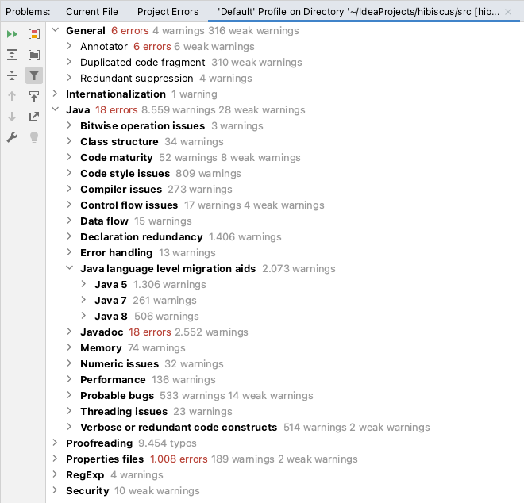

Hibiscus
========

Eine freie Homebanking-Anwendung für Linux, Windows und MacOS.
Sie basiert auf der FinTS-Implementierung [HBCI4Java](https://github.com/hbci4j/hbci4java) und läuft als Plugin in [Jameica](https://github.com/willuhn/jameica)

:warning: Dies ist ein Fork!

# Acknowledgement

Der erste Commit von _Hibiscus_ stammt vom 2004-02-08 und die Software wird durch @willuhn auch nach so vielen Jahren noch aktiv betreut und weiterentwickelt. Dafür haben [er und alle Helfer](https://github.com/willuhn/hibiscus/graphs/contributors) meine Anerkennung und Respekt!

# Zielstellung
Ich habe diesen Fork erstellt, da ich zum Einen etwas dem Projekt zurückgeben möchte und zum Anderen einige Auffälligkeiten im Code entdeckt habe.

Im Folgenden werden die unterschiedlichen Aspekte/ Teilziele detailliert.

## Code-Usability
Es hat mich fast einen halben Tag gekostet bis aus der aktuellen Codebasis ein lauffähiges Programm compiliert wurde.
Deshalb möchte ich durch Dokumentation und Anleitungen sowie defacto-standardisierten Dateien zukünftigen Programmierern die Arbeit erleichten.
So wird die Hürde niedriger und erhöht hoffentlich die Attraktivität, damit auch in Zukunft weitere Verbesserungen und Aktualisierungen eingereicht werden.

Geplant ist unter anderem:
* Anleitung, wie IDE einzurichten. Im Original wird verwiesen auf [Anleitung auf Webseite](http://www.willuhn.de/products/hibiscus/dev.php), jedoch ist es sinnvoller, wenn jene direkt als Textdatei im Repository liegt. Der Installer für Eclipse OOMPH ist schwer einzurichten und nur Eclipse nutzbar. Eventuell könnte man das auch unabhängig von der IDE umsetzen (über Gradle?) zumal es nur für SWT notwendig ist, was seit 2017 als Maven-Repo mit plattformspezifischen Versionen existiert.
* Grundregeln für Lieferung von Code (vgl. <https://github.com/kmindi/special-files-in-repository-root>)

## Modernisierung
Die Codebasis datiert bis zurück ins Jahr 2004.
Der Start war also mit Java-Version _J2SE 1.4_ und einigen Codezeilen sieht man jenes Alter an.
Seitdem hat sich Vieles verändert, wie etwa der [Artikel](https://www.informatik-aktuell.de/entwicklung/programmiersprachen/wandlung-von-java.html) beschreibt.
Zum Zeitpunkt des Forks (2021-05-15) ist das Compilerlevel in der Konfiguration auf Java-Version 8 eingestellt.
Der Code selbst nutzt jedoch in breiten Teilen noch den Stil von _J2SE 1.6_ und kann an vielen Stellen verschlankt werden.
Die Nutzung von neueren Methoden ermöglicht auch, dass der Compiler besser optimieren kann, und beschleunigt somit die Ausführung.
Gleichzeitig wird die Lesbarkeit erhöht, was der Wartbarkeit zugutekommt und somit hoffentlich die Fehlerbehebung vereinfacht.

Geplant ist unter anderem:
* Umstellung auf aktuelle Java-Version (sukzessive: Java 5 -> Java 8 -> Java 11 -> Java 17)
* Beseitigen der `deprecated`-Warnungen
* Anpassung Code-Stil
	* Raw-Types um passende Typdeklarationen ergänzen
	* `while(x.hasNext())` durch `for` ersetzen
	* Nutzung von `streams`, wo möglich
	* Vermeidung von Typcasting, wo möglich
	* Ersetzen von `void`-Methoden mit IN/OUT-Parametern, wo möglich (NICHT Public-API/ Jameica)
* [Checkstyle](https://checkstyle.org/)-Prüfungen durchführen und Warnungen beheben
* Nutzung von [Gradle](https://gradle.org/) statt Jar-Dateien in den Ordnern `lib` und `lib.src` (ggf. sogar das [ANT-Script](/build/build.xml) ersetzen?)

Zuerst wird auf das Sprachlevel von Java 8 fokussiert und eine möglichst hohe Abarbeitung der Auffälligkeiten.
Erst danach werden die höheren Versionen von Java adressiert.
Bereits für Java 8 liefert IntelliJ bereits eine nicht ganz kleine Liste (Stand 2021-05-16):

## Testbarkeit
Zum Zeitpunkt des Forks hat die Codebasis exakt zwei (!) Testklassen.
Jene erzeugen eine Code-Coverage von 0,6%.
Das möchte ich verbessern!

Geplant ist unter anderem:
* Umstellung [JUnit](https://junit.org/) von Version 4 auf 5
* Tests schreiben
* Nutzung von Tools wie [Mockito](https://site.mockito.org/) oder [Cucumber](https://cucumber.io/tools/cucumber-open/) in Erwägung ziehen
